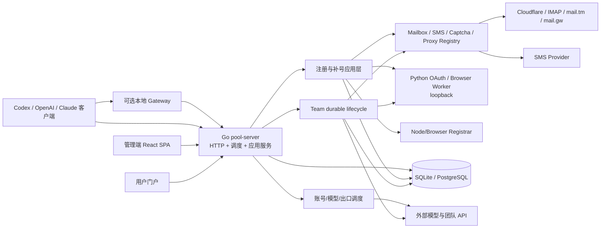
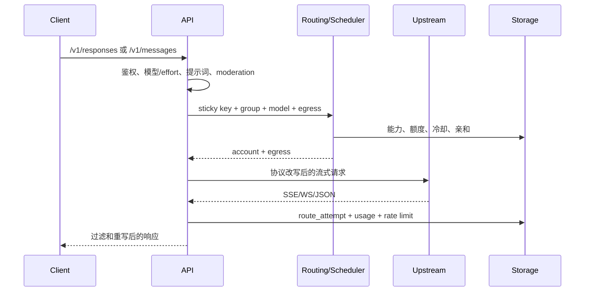
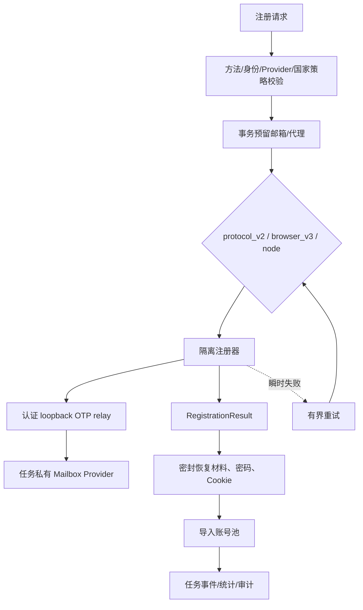
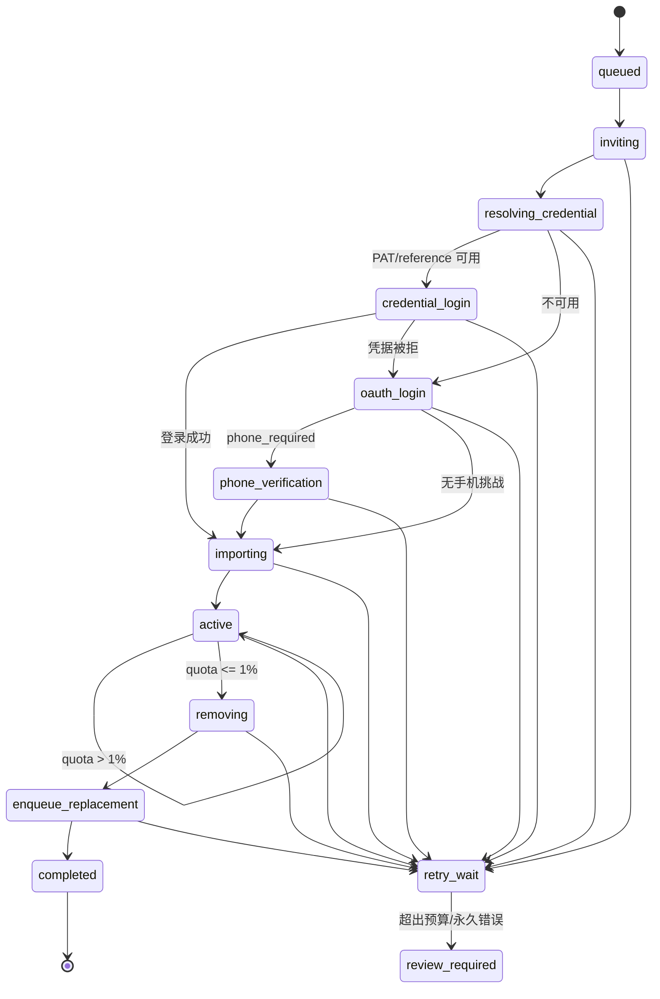
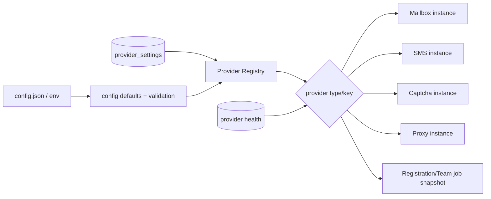
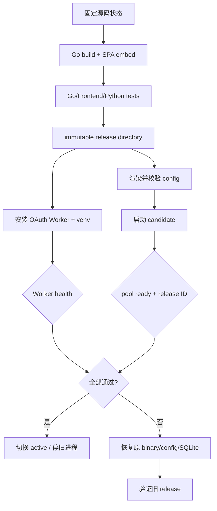

# 项目现状审计、目标架构与本轮整改报告

## 0. 审计范围与方法

- 依据：`docs/plan/1.txt`
- 源码范围：Go 主服务/网关、SQLite/PostgreSQL 存储、Python/Node 注册器、
  React/Vite SPA、安装/更新/回滚脚本、诊断工具。
- 运行约束：本地只读代码和编辑；构建、测试、数据库填充、安装、服务运行和浏览器
  截图全部在远端 Linux 原生进程执行，未使用 Docker。
- 回归原则：保留旧 API、旧配置、旧数据库、旧控制台入口和原有注册方法；新增能力
  通过适配器、迁移和默认值渐进启用。
- 两份最新诊断包均已做 CRC、结构、时间序列和差分分析；详见
  `../backend-latest-diagnostics-20260731/comparison.md`。

## 1. 执行摘要

项目是一个以 Go 单体服务为中心的多协议账号池和管理平台。它同时承担
OpenAI/Codex/Claude 中继、账号调度、用量与额度、注册自动化、生命周期、管理端和
用户门户。当前规模仍适合“模块化单体 + 少量隔离 Worker”，不适合为了形式拆成大量
微服务。

本轮确认并修复的主要问题：

1. **前端信息密度与长值布局**：账号、邮箱、团队成员、设置与注册页面在长名称和
   移动端下缺少明确层级。已改为 Apple 风格语义 token、柔和层次、清晰额度条、
   中间省略、响应式卡片和主题一致的可视化。
2. **邮箱 Provider 串扰**：共享进程环境的 OTP Provider 在并发任务中可能相互覆盖。
   已改为每任务独立 Provider/relay，并加入事务邮箱预留。
3. **自有域邮箱缺口**：新增 Cloudflare 自建邮箱 profile、健康探测、默认注册/
   团队邮箱和最小权限管理 UI，同时兼容 mail.tm/mail.gw 与通用 HTTP 邮箱。
4. **团队轮换缺少 durable orchestration**：新增租约、版本、事件、幂等键、错误
   分类、指数退避和八阶段状态机。
5. **PAT/OAuth/手机分支混乱**：PAT 优先；PAT 登录被拒或不可用时显式进入 Codex
   OAuth；只有 OAuth 实际返回手机挑战时才进入 `add_phone` 与 SMS。
6. **安装器漏装 OAuth Worker**：`install.sh` 现在安装、启动、健康检查并随 A/B
   切换/回滚管理独立 loopback Worker。
7. **诊断存储硬上限死区**：256 MiB 目标存储曾仅剩 340 字节却不会触发维护；
   已引入低水位目标与 32 MiB 预留。
8. **重复路由审计放大磁盘**：非 409 重复事实改为 30 秒合并一次，严格 409 和
   每次 `route_attempts` 仍完整保存。

最终远端结果：

- Go 全量测试、vet 和定向 race 全绿。
- 前端检查、TypeScript、78 个测试和生产构建全绿。
- 原生完整安装退出 0，主服务与 OAuth Worker 健康。
- 直接 SQLite 演示数据完整性 `ok`；16 账号、20 邮箱、288 用量、8 团队工作流。
- 32/32 明暗主题 × 桌面/移动端页面检查通过，生成 33 张截图。
- 两个生产原生服务部署、真实回滚、重部署和最终复核均退出 0。

## 2. 当前架构

### 2.1 系统架构



### 2.2 目录和职责

| 区域 | 类型 | 当前职责 | 审计结论 |
| --- | --- | --- | --- |
| `cmd/pool-server` | 核心入口 | 配置、存储、调度、上游、API 和后台任务装配 | 保持单入口；继续缩小装配函数 |
| `internal/api` | 接口/应用层 | 协议入口、管理 API、门户、诊断与应用编排 | 文件数量大，仍是最高耦合区域 |
| `internal/storage` | 基础设施层 | schema、迁移、SQLite/PostgreSQL CRUD | `storage.go` 过大；新域已拆到独立文件 |
| `internal/scheduler` / `routing` | 核心域 | 账号、模型、出口、亲和与冷却 | 核心稳定，不应与注册器合并 |
| `internal/upstream` | 外部适配层 | Codex、Claude、自定义 Provider、SSE/WS | 通过客户端接口复用出口与 Cookie jar |
| `internal/registration/pipeline` | 应用层 | protocol/browser/node 注册、OTP relay、结果归一 | 已统一邮箱实例和结果契约 |
| `internal/registration/provider` | 扩展层 | Mailbox/SMS/Captcha/Proxy 能力注册 | 适合作为能力插件边界 |
| `internal/registration/teamflow` | 核心域 | 团队成员 durable 状态机 | 新增；不依赖具体远端协议 |
| `services/codex_register` | 隔离执行层 | 浏览器/OAuth/手机验证脚本 | 由 loopback Worker 承载，避免塞进 Go 请求线程 |
| `web-spa` | 表现层 | 管理端、门户、主题、图表与响应式布局 | 已建立统一 token/组件/查询边界 |
| `scripts` / `install.sh` | 发布层 | 构建、原生安装、A/B 切换、诊断、回滚 | OAuth Worker 已纳入同一发布事务 |
| `internal/web` / `/legacy` | 兼容层 | 旧版控制台 | 暂不删除；明确为兼容入口 |

### 2.3 模块依赖

```mermaid
graph TD
    Main[cmd/pool-server] --> Config[internal/config]
    Main --> Storage[internal/storage]
    Main --> API[internal/api]
    Main --> Scheduler[internal/scheduler]
    Main --> Upstream[internal/upstream]
    API --> Storage
    API --> Scheduler
    API --> Upstream
    API --> Pipeline[registration/pipeline]
    API --> TeamFlow[registration/teamflow]
    Pipeline --> Provider[registration/provider]
    Pipeline --> Storage
    TeamFlow --> RepoPort[Repository interface]
    TeamFlow --> AdapterPort[Adapter interface]
    RepoPort --> Storage
    AdapterPort --> NativeConnector[api/nativeTeamLifecycleConnector]
    NativeConnector --> Upstream
    NativeConnector --> Pipeline
    NativeConnector --> Storage
    SPA[web-spa] --> AdminAPI[/admin APIs]
    AdminAPI --> API
```

依赖方向整体合理；最需要继续处理的是 `internal/api` 同时承担 HTTP、应用编排和
部分外部适配器实现。TeamFlow 已用窄接口切断该问题，后续新域应沿用这一方式。

## 3. 核心业务与数据流

### 3.1 模型请求



### 3.2 注册数据流



敏感值不放入 durable 工作流事件。事件只记录 error class、操作键和不透明引用。

### 3.3 Team 生命周期



控制点：

- 每个远端步骤使用 `workflow_id:state` 形式的稳定幂等键。
- Claim/renew 使用租约；transition 使用版本号防止双执行。
- 同域策略在创建工作流时验证母号/子号邮箱域，并固定支持同域分配的方法。
- `shadow_mode` 只产生完整计划和事件，不发送远端副作用。
- 可重试错误指数退避；达到 `max_attempts` 后进入 `review_required`。

### 3.4 关键数据库族

| 数据族 | 主要表 | 一致性策略 |
| --- | --- | --- |
| 账号与认证 | `accounts`、token/cookie/reauth 表 | 敏感字段密封、账号级引用 |
| 路由与额度 | affinity、capability、rate_limits、usage | 事务写入、时间窗索引、逐次 route attempt |
| 注册 | jobs、records、workflow_items、events、email_pool | 邮箱事务预留、幂等 job/event ID |
| Provider | `provider_settings`、`mailbox_provider_health` | 唯一 `(type,key)`、auth 与 config 分离 |
| Team | workspaces、members、child_pool、workflows、events | 租约、版本、唯一 idempotency key、事件序列 |
| 诊断 | diagnostic jobs/events、storage resources | 有界包、租约、低水位维护 |

## 4. 配置、能力注册与插件边界

### 4.1 当前加载流程



当前实现属于“配置驱动的能力热重载”，不是任意动态库加载：

- Provider profile 可在数据库中安装、启停、调整优先级和健康探测，无需重启。
- 每个任务拿到配置快照并构造独立实例；正在运行的任务不受下一次配置修改污染。
- Python OAuth Worker 是独立进程，通过 loopback HTTP 和健康门隔离。
- Go 核心模块仍在编译期链接，避免 Go `plugin` 的平台/ABI 风险。

### 4.2 建议的通用 Manifest（下一阶段）

不建议立即允许任意代码热加载。先把现有 Provider 配置演进为签名能力清单：

```json
{
  "id": "mailbox.cloudflare_temp_email",
  "version": "1.0.0",
  "entry": "builtin:cloudflare_temp_email",
  "platforms": ["linux-amd64"],
  "permissions": ["network:https", "secret:mailbox_admin_token"],
  "depends": [{"id": "core.registration", "range": ">=1.0 <2"}],
  "provides": ["mailbox.create", "mailbox.wait_otp", "mailbox.delete"],
  "consumes": ["http.client", "secretbox"],
  "config_schema": "schemas/cloudflare-mailbox-v1.json",
  "migration": 1,
  "sha256": "SLOT",
  "signature": "SLOT"
}
```

推荐生命周期：

```text
discover → validate → install → initialize → start → ready
         → pause → drain leases → stop → dispose
         → upgrade/rollback → healthCheck
```

代码型扩展优先采用独立进程 + loopback RPC；配置型 Provider 保持进程内工厂。

## 5. 冗余分析

| 项目 | 位置 | 当前用途 | 重复对象 | 可合并 | 风险 | 推荐/本轮处理 |
| --- | --- | --- | --- | --- | --- | --- |
| 新旧控制台 | `internal/console`、`internal/web` | SPA 与旧 UI | 页面/API 展示 | 部分 | 外部书签和旧操作路径 | 保留 `/legacy`，新能力只进 SPA；收集访问量后再退役 |
| 注册方法代际 | browser、browser_v2/v3、protocol/protocol_v2、node | 不同上游页面/协议兼容 | 相似步骤 | 只合并公共层 | 上游变化时旧方法是回退 | 已统一 Provider、relay、结果和错误；不删方法 |
| 邮箱实现 | Cloudflare、generic HTTP、IMAP、mail.tm、temp mail | 不同 API | create/wait/delete | 是 | 各 API 契约不同 | 已统一 interface/registry，保留适配器 |
| 邮箱配置来源 | 文件、环境、DB profile | 兼容旧部署与动态配置 | 同一字段 | 渐进 | 直接移除会破坏安装 | DB profile 优先，旧配置作为 fallback |
| 设置旧路由 | `/settings`、`/automation` 等 | 旧链接兼容 | SettingsV2 tabs | 是 | 链接兼容 | 已用 redirect 收敛，不复制页面 |
| 存储实现集中 | `storage.go` 与领域文件 | schema/迁移/CRUD | 扫描和 SQL helper | 是 | PostgreSQL 方言和迁移顺序 | 新域已拆文件；继续逐域迁移，不一次重写 |
| 路由失败事实 | route attempts 与 audit | 逐次诊断与人工审计 | 非 409 高频重复 | 部分 | 过度合并会丢事实 | 逐次 attempts 保留，非 409 audit 30 秒合并 |
| Worker 启动逻辑 | 手动 Python 与 install service | OAuth/浏览器 | 进程生命周期 | 是 | 漏装或版本错配 | 已统一进 `install.sh` 和 rollback |
| 页面表格/移动卡片 | 多页面自定义渲染 | 桌面与移动端 | 资源展示 | 是 | 业务列不同 | 复用 `ResourceTable`/Clamp/SummaryRail，保留列定义 |

未删除任何“疑似无用”兼容文件。动态调用、配置引用、旧路由和平台差异尚未有足够
证据时，只做收敛层。

## 6. 耦合矩阵

等级：严重 / 高 / 中 / 低。

| 调用方 \\ 被调用方 | API | Storage | Scheduler | Upstream | Registration | Provider | SPA | Installer |
| --- | --- | --- | --- | --- | --- | --- | --- | --- |
| API | 中 | **高** | 高 | **高** | 中 | 低 | 低 | 低 |
| Storage | 低 | 中 | 低 | 低 | 低 | 低 | 低 | 低 |
| Scheduler | 低 | 中 | 中 | 低 | 低 | 低 | 低 | 低 |
| Registration | 中 | 中 | 低 | 中 | 中 | 中 | 低 | 低 |
| TeamFlow core | 低 | 低 | 低 | 低 | 低 | 低 | 低 | 低 |
| Native Team adapter | 中 | 中 | 低 | 中 | 中 | 中 | 低 | 低 |
| SPA | 中（API 契约） | 低 | 低 | 低 | 低 | 低 | 中 | 低 |
| Installer | 低 | 低 | 低 | 低 | 中 | 低 | 中 | 中 |

重点：

- `internal/api` 对 Storage/Upstream 的高耦合是当前主要架构债务。拆分方式不是新增
  网络服务，而是在进程内提取 `AccountApplication`、`DiagnosticsApplication` 和
  `RegistrationApplication` 接口。
- TeamFlow core 只依赖 Repository/Adapter，已能独立内存测试，是目标样板。
- SPA 与后端通过 zod/TypeScript 契约和 API feature 模块隔离；不再让页面直接散落
  Axios 细节。

## 7. 稳定性与容灾

| 场景 | 当前行为 | 本轮增强 | 结论 |
| --- | --- | --- | --- |
| 单个后台 goroutine panic | supervisor 统一恢复 | OTP/邮箱 relay 新增 panic boundary | 不拖垮主进程 |
| 网络/429/5xx | 分类、超时、冷却 | Team 状态机显式 retry class/指数退避 | 有界恢复 |
| Provider 暂时失败 | 过去可能禁用邮箱 | 健康记录与瞬时错误分离 | 不因一次错误丢失 profile |
| 重复任务 | 部分 job ID 防重 | Team 操作键、唯一 idempotency key、版本 | 可重放 |
| 进程退出 | 注册信息分散 | 工作流状态/事件/恢复引用持久化 | 可断点续跑 |
| 数据库并发 | SQLite busy/事务 | 邮箱 reservation 原子化、租约 claim | 避免双领 |
| 配置损坏 | 启动校验 | Worker 地址/loopback/端口/并发安装前校验 | 失败在切换前 |
| 更新失败 | A/B release | OAuth Worker 纳入健康门和 rollback | 主/Worker 同版本 |
| 磁盘接近上限 | 硬限前形成死区 | 低水位目标 + 预留量 | 已修复 |
| 外部响应过大 | 部分 handler 限制 | Team 响应 1 MiB、邮箱请求统一 body limit | 有界内存 |
| SSRF | 通用邮箱 URL 风险 | DNS/IP/重定向二次校验、仅 loopback 允许 HTTP | 已加固 |
| 部分数据损坏 | SQLite backup/diagnostics | 安装和演示填充前后均 SQLite backup + integrity | 可恢复 |

仍然存在的单点：

- 单实例 SQLite 部署中的 pool-server 和 OAuth Worker 各是单点。当前规模可接受；
  需要高可用时应切 PostgreSQL 并使用数据库租约运行多实例，而不是共享 SQLite。
- 浏览器注册依赖上游页面结构和 Chromium；必须继续维持 canary 和失败截图。
- 上游团队接口可能变化；连接器已隔离，但仍需契约探针与 feature flag。

## 8. 安全审计

### 已落实

- 管理 API 继续使用 admin token/会话鉴权，Cloudflare profile API 不回显
  `AdminToken`，只返回 `configured`。
- Provider auth 与 config 分列存储；恢复密码、Cookie、token 使用项目 secretbox
  密封，工作流只保存不透明引用。
- OAuth Worker 只监听 `127.0.0.1`；健康响应 `no-store` 和
  `nosniff`。邮箱 relay 同样使用 loopback 和任务随机 token。
- 手机号、验证码和恢复凭据不写审计日志；Python 日志新增脱敏。
- 通用邮箱 endpoint 拒绝嵌入凭据、query/fragment、私网、link-local、multicast、
  `.local`，并对 DNS rebinding/redirect 重新判定。
- 邮箱和 Team 标识符有长度/控制字符限制；事件 JSON 有 4 KiB 上限；远端响应有
  1 MiB 上限。
- 原始二进制、配置和 SQLite 使用 SHA-256/SQLite backup 保存；修改在新 release
  目录运行。

### 后续关注

1. 生产 admin token 的轮换与审计仍依赖运维流程，建议引入双 token 短过渡窗口。
2. Python/Node 依赖应在下一阶段生成 SBOM 并固定 wheel/npm 完整性清单。
3. PostgreSQL 路径虽有翻译与单元测试，但本轮原生运行验证使用 SQLite；上线
   PostgreSQL 前应执行专属迁移/锁竞争测试。
4. 外部 Provider 凭据应进一步支持 OS/KMS envelope key，而不是只依赖本机密钥。

## 9. 性能与资源

### 9.1 已确认瓶颈

1. **目标连续性存储死区**
   - 两份诊断均为 `268435116 / 268435456` 字节，仅剩 340 字节。
   - 7,701 秒新增 2,986 次 `storage_budget`。
   - 修复后 256 MiB 配置的维护目标为 `234881024`，预留 `33554432`。
2. **重复路由审计**
   - 新快照窗口 3,447 次路由结果中，非严格失败会重复写 audit。
   - 修复后同诊断键非 409 在 30 秒内最多一条；409 仍逐次写。
3. **邮箱全局配置串扰**
   - 这是并发正确性问题，也会导致无效重试和额外网络。
   - 已改任务私有实例，race 定向验证通过。

### 9.2 前端实测

远端 Chromium、真实 Go 服务、直接 SQLite 演示数据：

| 指标 | 结果 |
| --- | ---: |
| 页面/主题/视口组合 | 32 |
| 自动检查通过 | 32/32 |
| 加载最小值 | 1,645 ms |
| 中位数 | 1,819 ms |
| P95 | 2,126 ms |
| 最大值 | 2,546 ms（含生命周期明细交互） |
| 文档横向溢出 | 0 |
| 同源 HTTP >=400 | 0 |
| 控制台/page error | 0 |
| 最终截图 | 33 |

这些时间包含鉴权、接口读取、字体稳定等待和固定 900 ms 截图稳定窗口，不能当作纯
首屏 TTI；用于同一环境回归是可靠的。

### 9.3 资源结论

- 最终 Go 二进制 `30,006,032` 字节。
- 注册浏览器是主要可变内存来源，因此继续独立 Worker、有界并发 2，而不是每请求
  启动无限 Chrome。
- React 路由 lazy load、React Query 去重和图表懒加载已经降低常驻前端资源。
- 未取得稳定的生产 CPU/RSS 长周期样本，不能声称 CPU 或内存降低；建议继续采集
  24 小时 p50/p95 RSS、goroutine、FD、SQLite busy 和浏览器峰值。

## 10. 可观测性

当前拥有：

- `/readyz` deployment state、release ID、fencing token、storage check。
- `/admin/system` 磁盘守护、目标存储 reserve/target、任务与 Provider 状态。
- registration job/events/log export、Team workflow events、mailbox health。
- v3 诊断包、CRC、租约下载、脱敏 business logs。
- audit log 与逐次 route attempts 分层。

建议新增但不阻塞本轮交付：

- Team 各状态停留时长和 retry class 直方图。
- 邮箱 create/OTP/delete 分步骤 latency 与成功率。
- Worker Chrome 进程数/RSS/退出码。
- SQLite busy duration/事务等待和慢查询 top-N。
- 安装/回滚统一 OpenTelemetry deployment span。

## 11. UI/UX 审计

### 已整改

- 语义颜色、圆角、层级阴影、磨砂表面、浅/深色 canvas 统一到 token。
- Dashboard 采用大数字、柔和卡片、环图/条图/趋势图，避免工业化密集表格。
- 账号卡明确显示“剩余/已用”、token/请求、重置时间和来源。
- 长账号/邮箱/组名使用中间省略、tooltip/title 和固定最小宽度；移动端改为卡片。
- 注册、设置、团队生命周期和 Cloudflare 邮箱有独立信息层级与任务解释。
- Team Hero 显示八阶段和醒目的 1% 轮换阈值。
- 深色模式不是简单反色：单独的 canvas、surface、边框、成功/警告/危险色。

### 截图人工抽检

- `desktop-light-dashboard.png`：图表层次、快速操作与关注卡清晰。
- `desktop-dark-dashboard.png`：深色 surface 和图表色不混淆。
- `mobile-light-accounts.png`：102 字符邮箱与 73 字符账号标签无页面溢出。
- `desktop-dark-team-lifecycle.png`：0.75%、1.00%、PAT/OAuth 路径可比较。
- `mobile-dark-cloudflare-mailbox.png`：配置、三步接入、健康/延迟和默认标记完整。

## 12. 更新、回滚与运行



本轮不仅检查了脚本语法：

- `install.sh --full --with-registration --no-systemd` 在隔离目录真实安装成功。
- 主服务 `34277`、Worker `34279` 健康，配置 URL 精确匹配。
- 两个现有服务部署到新 release，Worker 在 `8802` 健康。
- 实际停止新版本、恢复原 config/SQLite/binary、启动旧 release 并核验。
- 再部署新版本并核验所有新增 API。

## 13. 目标架构与渐进路线

### 保持

- 模块化单体作为主要运行形态。
- Storage、Scheduler、Routing、Upstream 作为核心内部模块。
- 浏览器/OAuth/高风险第三方 SDK 使用独立 Worker。
- SQLite 单机与 PostgreSQL 多实例两种部署面。

### 下一阶段 P1

1. 从 `internal/api` 提取 Registration/Diagnostics application service。
2. Provider profile 增加版本、capability、config schema 和 checksum 字段。
3. 加 Team/邮箱/Worker 指标及 24 小时资源基线。
4. 为 Cloudflare API adapter 增加版本协商和契约 canary。
5. 为 PostgreSQL 执行迁移、lease 竞争和事务 reservation 专测。

### 下一阶段 P2

1. 独立进程 Provider 的签名 Manifest 与权限 allowlist。
2. Worker drain/pause/upgrade 协议和 in-flight 状态转移。
3. SBOM、依赖 provenance 与离线安装缓存。
4. 旧控制台访问量归零后，先只读冻结，再按版本移除。

禁止事项：

- 不把当前单体机械拆成大量网络服务。
- 不用反射/任意动态库换取表面“热插拔”。
- 不删除旧注册器、旧配置或旧 API，除非有使用证据和完整兼容窗口。

## 14. 验证索引

| 验证 | 记录 |
| --- | --- |
| Go 全量 | `remote-verification-records/go-all-green.literal.log` |
| Go vet/race | `remote-verification-records/go-vet-race.literal.log` |
| 前端全量 | `remote-verification-records/frontend-verify-green.literal.log` |
| Python Worker | `remote-verification-records/python-workers-rerun.literal.log` |
| Installer/Worker 静态 | `remote-verification-records/installer-reauth-static.literal.log` |
| 原生完整安装 | `remote-verification-records/install-current-wrapper.literal.log` |
| 直接数据库填充 | `remote-final/records/direct-seed-rerun.literal.log` |
| 32/32 截图 | `remote-final/screenshots/final/final-ui-visual-report.json` |
| 生产部署 | `remote-production/records/deploy.literal.log` |
| 真实回滚 | `remote-production/records/rollback.literal.log` |
| 重部署 | `remote-production/records/redeploy.literal.log` |
| 最终服务面 | `remote-production/records/final-verify.literal.log` |

## 15. 最终风险裁决

| 风险 | 等级 | 裁决 |
| --- | --- | --- |
| 上游 Team/PAT 私有契约漂移 | 高 | 连接器隔离、canary、显式 review；不扩散到核心状态机 |
| 浏览器页面变化 | 高 | browser_v3 与 protocol_v2 双路径、失败截图、恢复会话 |
| 手机验证策略变化 | 中 | 挑战驱动分支，不硬编码为必经步骤 |
| 自建邮箱 API 漂移 | 中 | adapter/version 字段、健康测试、通用 Provider fallback |
| SQLite 单实例故障 | 中 | 原生 backup/rollback；HA 场景切 PostgreSQL |
| Worker 资源峰值 | 中 | loopback 隔离、并发 2、健康门；继续采集 RSS |
| 旧代码冗余 | 低至中 | 保留兼容层并逐步观测，不进行无证据删除 |

当前版本适合继续以原生单机方式运行；已验证的回滚路径可以恢复到原 release 和原
数据库语义状态。
