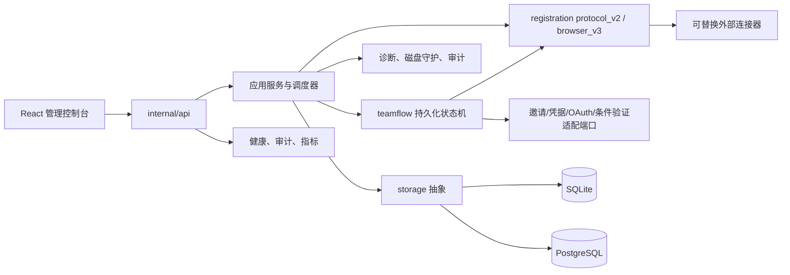
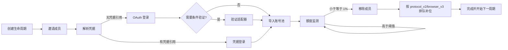
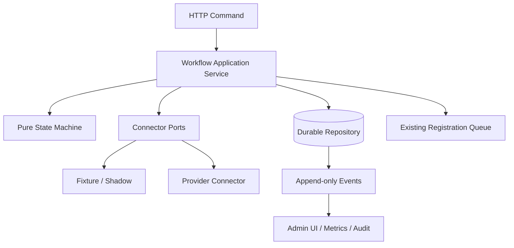

# 全项目后端复核与渐进优化报告

> 基准：`docs/plan/1.txt`；复核日期：2026-07-31。  
> 原则：保持旧配置、旧 API、旧 SQLite/PostgreSQL 数据与原有注册路径兼容；
> 所有新增能力均经适配器接入、默认影子执行、可独立回滚。

## 1. 架构现状

项目是一个 Go 原生服务与内嵌 React/Vite 管理控制台组成的模块化单体：

| 层 | 主要位置 | 职责 |
|---|---|---|
| UI 表现层 | `web-spa/src` | 管理、注册、生命周期、观测与设置 |
| 接口适配层 | `internal/api` | 鉴权、输入约束、HTTP 契约、错误映射 |
| 应用服务层 | `internal/registration` | 注册、健康检查、生命周期协调 |
| 领域/工作流层 | `internal/registration/teamflow` | 成员轮换状态、分支、重试、租约 |
| 基础设施层 | `internal/storage` | SQLite/PostgreSQL、迁移、CAS、分页 |
| 运维层 | `install.sh`、`scripts/install.sh` | 原生安装、不可变发布、自检、回滚 |

核心业务链路：

## 2. 本轮确认问题、依据与整改

| 优先级 | 维度 | 确认问题与依据 | 整改 | 风险控制 / 验证 |
|---|---|---|---|---|
| P0 | 数据 | `team_management.go` 只有未落地定义，SQLite 初始化与 PG 迁移未应用，重启后没有可靠生命周期 | 新增可重复执行模式、SQLite 初始化、独立 PG 迁移 `20260731_team_lifecycle_v1` | 旧基础迁移校验值不变；旧模式升级测试通过 |
| P0 | 凭据 | 旧草案存在把成员凭据直接放进成员池的可能 | 新流程只持久化 `account_auth_tokens:<id>` 等不透明引用，密文继续由 `account_auth_tokens` 管理 | API 与生产模式检查均证明无 `access_token/refresh_token/password/phone_number` 字段 |
| P0 | 稳定性 | 跨多个远程步骤缺少持久状态、幂等键、CAS、租约、崩溃恢复 | 引入严格状态机、事件序列、幂等创建、版本 CAS、租约/心跳、重试等待、取消与人工复核 | 状态迁移、重复提交、过期租约、重试、取消、panic 边界测试 |
| P0 | 诊断 | 两包均把目标存储钉在 `268435116/268435456` B，只剩 340 B；较新窗口新增 2,986 次降级 | 磁盘守护按低水位主动回收，硬上限提交语义保持不变 | 同输入从 655,875 B 回收到 393,525 B；全量测试、真实诊断包通过 |
| P1 | 并发 | 注册 provider 热重载会与进行中的 attempt 共享可变 pipeline | `pipelineMu` 保护发布；一次 attempt 使用不可变快照 | `go test -race` 定向用例通过 |
| P1 | 资源 | 生命周期检查器先 `ListAccounts()` 全量载入再切片，表面分批、实际内存无界 | 新增 `ListAccountsPage`，逐页读取并释放 | 53 条、页长 17 的注入测试实际调用 `[17,17,17,2]` |
| P1 | 一致性 | 生命周期补位若自行实现注册，会绕过 readiness、canary、出口与并发门控 | 通过 `Handler.EnqueueLifecycleReplacement` 复用现有完整注册栈 | protocol/browser 选择与默认方法均有 API/适配器测试 |
| P1 | 审计噪声 | 非 409 `routing_unavailable` 重复写审计，压缩诊断窗口 | 30 秒/键有界合并；逐次 route attempt 与严格 409 保留 | 同输入非 409 审计 3→1，严格 409 仍 2→2 |
| P1 | 工作进程 | 全量测试首次暴露 supervisor 子协程 panic 可越过边界 | 在协调器与 lease 心跳增加 panic 边界 | 修复后 `go test ./... -count=1` 全量通过 |
| P2 | 产品 | 生命周期状态、额度阈值与分支不可见 | 新增管理 API、事件时间线、Apple 风格明暗 UI、1% 阈值环与长标识省略 | 数据夹具 4/4、暗色全路由 72/72、正式服务 4/4 |

## 3. 冗余与失活能力复核

| 项目 | 位置 | 原用途 | 重复/失活对象 | 结论 | 处理 |
|---|---|---|---|---|---|
| 生命周期建表字符串 | `internal/storage/team_management.go` | 团队数据定义 | 未由 store 初始化调用 | 失活且有数据丢失风险 | 保留兼容列名并接入正式迁移 |
| 补位注册实现 | 生命周期与注册模块 | 创建替代账号 | 容易复制注册前置门控 | 可合并，不能删除原注册方法 | 统一进入现有 Handler |
| provider pipeline | `internal/api/registration.go` | 动态配置刷新 | 同一结构被读写双方共享 | 需要快照而非第二套 pipeline | 增加原子快照边界 |
| 账号批处理 | 生命周期 scheduler | 分批健康检查 | 全量读取后再切片 | “假分页” | 改为 storage 真分页 |
| 远程具体实现 | teamflow | 邀请、登录、验证 | 不同平台各自可能重复状态控制 | 不应写入核心状态机 | 统一端口，具体 connector 可替换 |
| UI 指标卡/长文本 | 多管理页 | 额度与长账号展示 | 各页局部 CSS 重复 | 可渐进统一 | 复用 metric/text-clamp/resource primitives |

动态调用、配置引用、旧数据兼容均已检查；本轮没有删除疑似兼容代码。

## 4. 耦合矩阵

等级为本轮整改后的剩余耦合；括号内是整改前判断。

| 调用方 \ 被调用方 | API | teamflow | 注册栈 | storage | 远程 connector | UI |
|---|---:|---:|---:|---:|---:|---:|
| API | 低 | 中 | 中 | 中（高） | 低 | 低 |
| teamflow | 低 | 低 | 低（高风险重复） | 中 | 低（严重） | 低 |
| 注册栈 | 中 | 低 | 中 | 中 | 中 | 低 |
| storage | 低 | 低 | 低 | 中 | 低 | 低 |
| UI | 中 | 低 | 低 | 低 | 低 | 低 |

拆分措施：

1. 远程邀请、凭据解析、OAuth、条件验证、成员移除均通过窄接口注入；
2. 持久状态与执行器分离，状态机可用 fixture 独立测试；
3. API 只暴露引用与状态，不暴露 connector 内部结构；
4. 注册补位通过现有应用服务，而不是从 teamflow 访问 registrar 内部实现；
5. UI 依赖稳定 JSON 契约，空数据、长标识和移动端均有单独呈现。

## 5. 稳定性、容灾与安全

| 场景 | 行为 |
|---|---|
| 进程中断 | 工作流与事件已持久化；租约过期后可由其他 worker 认领 |
| 重复创建 | `Idempotency-Key` 返回同一工作流 |
| 并发推进 | `version` CAS 与 lease owner 防止双推进 |
| 远程超时 | 可重试错误进入指数退避；永久错误进入人工复核 |
| worker panic | supervisor 与心跳边界捕获，单任务不带崩主进程 |
| 配置未完整 | 默认 `shadow_mode=true`，生成计划与事件，不发起实际远程变更 |
| 凭据可用 | 走不透明凭据引用登录分支，跳过 OAuth 与条件验证 |
| 凭据不可用 | OAuth 分支按 connector 返回值决定是否进入条件验证 |
| 额度触线 | `quota_remaining_bps <= rotate_threshold_bps`，默认 100 bps（1%） |
| 移除后补位 | 复用现有 protocol/browser 注册 Handler 与全部门控 |
| 原生升级失败 | 保留原二进制、配置与 SQLite 在线备份，可执行脚本恢复 |

输入限制、事件 JSON 大小、状态转换、重试次数与 worker 数量均有上界。新增
HTTP 路由继续使用管理员鉴权与 `Cache-Control: no-store`；未认证访问实测为
401。

## 6. 性能与资源结论

### 已确认并修复

- 目标存储硬上限前死区：两份诊断包、精确字节与失败速率共同证明；
- 生命周期全量账号载入：代码路径与注入调用序列共同证明；
- provider 热重载数据竞争：race detector 定向证明；
- 重复路由审计：同输入前后审计条数证明。

### 高概率风险，已建立边界

- 远程步骤长尾：worker 有界、租约心跳、超时分类、指数退避；
- 多实例重复执行：数据库 CAS + lease fencing；
- 事件无限增长：API 查询有 limit，工作流事件采用有序小 JSON；生产需继续观测长期保留量。

### 继续观测

- CPA ambiguous 从 108 增至 310，但诊断包缺少足够的客户端层级事实，本轮不改变身份语义；
- 正式环境外部 connector 的 SLA、条件验证成功率、配额刷新延迟；
- PostgreSQL 生产规模下的 due-workflow 索引命中与锁等待；
- 冷启动、首屏和远程注册 P95/P99；现有证据不足时不填造基线。

## 7. 目标架构与渐进路线

已完成阶段：

1. 建立兼容模式与迁移；
2. 引入状态机、事件、幂等、租约、重试和影子模式；
3. 接入现有注册栈；
4. 增加管理 API 与 UI；
5. 远端全量测试、安装器、正式部署、真实回滚与再部署。

后续仅需按部署环境提供 `RemoteConnector` 实现与相应凭据/出口配置；核心状态、
数据库、API、UI、补位与恢复机制无需再重写。

## 8. 验证摘要

| 验证 | 结果 |
|---|---|
| Go 全量 | `go test ./... -count=1`，通过 |
| 注册热重载 race | `go test -race ...RegistrationProviderReloadUsesAtomicPipelineSnapshots`，通过 |
| 前端全量 | 17 files / 78 tests，通过 |
| TypeScript | `tsc --noEmit`，通过 |
| Vite production build | 通过 |
| 生命周期数据截图 | 明/暗 × 桌面/移动，4/4 |
| 暗色全路由矩阵 | 72/72 |
| 当前 `install.sh` | 全新原生目录，exit 0；自检、启动、直填、SQLite 完整性、4/4 截图 |
| 正式部署 | 两个原生服务就绪，核心数据指纹与数量不变 |
| 真实回滚 | 旧 release、旧控制台、旧数据库模式恢复 |
| 再部署 | 新 release、团队模式、控制台与数据恢复，最终状态通过 |

