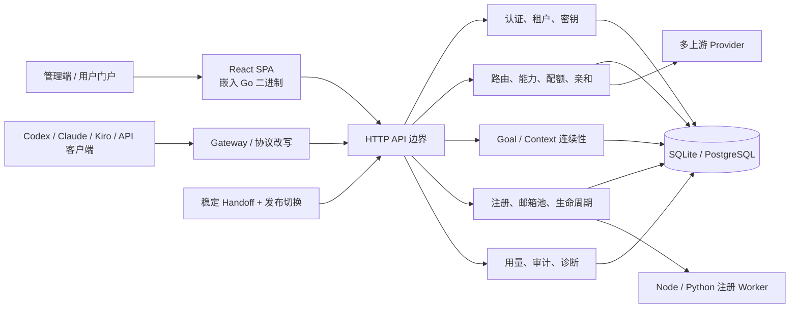
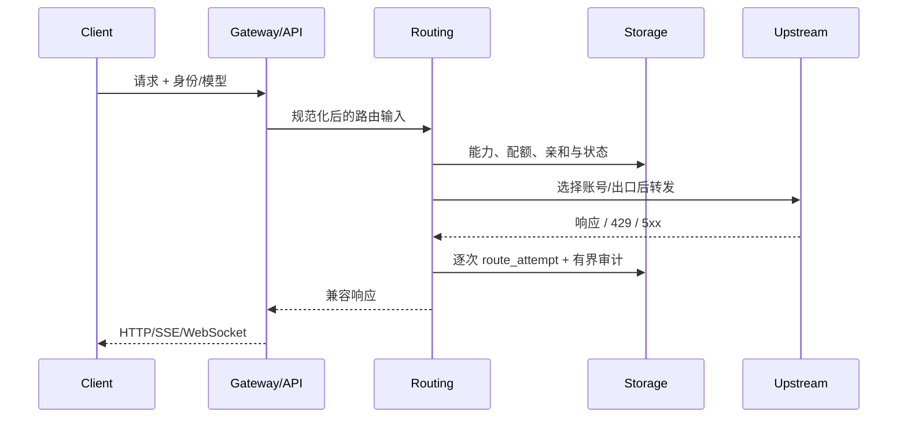

# 项目现状审计与已实施优化

## 审计范围

依据仓库实际存在的 `docs/plan/1.txt` 执行。静态范围包含 623 个 Go 文件
（309 个 Go 测试文件）、144 个前端源码文件、18 个前端测试/E2E 文件、
6 个命令入口和 48 个 `internal` 包。构建、测试、运行、数据库与浏览器验证均在
远端 Linux 原生环境完成。

## 架构概览

### 核心入口与职责

| 区域 | 入口/目录 | 职责 |
|---|---|---|
| 服务 | `cmd/pool-server` | API、嵌入式控制台、运行时编排 |
| 稳定切换 | `cmd/pool-handoff` | 发布切换、连接排空、健康门禁 |
| 客户端网关 | `cmd/gateway` | 协议适配、请求重写、入口代理 |
| API 适配层 | `internal/api` | 管理、路由、诊断、生命周期 HTTP 边界 |
| 领域与策略 | `internal/routing`、`capability`、`registration` 等 | 路由、能力、注册、可靠性策略 |
| 基础设施 | `internal/storage`、`config`、`supervisor` | 持久化、配置、进程与资源管理 |
| UI | `web-spa/src` | 管理端、设置、注册、邮箱/账号池、观测与门户 |
| 可选运行时 | `workers/node-registrar`、`services/*` | 浏览器/协议注册和辅助流程 |

## 关键数据流

## 已确认问题、优先级与处理

| 优先级 | 证据 | 根因 | 处理 |
|---|---|---|---|
| P0 | 两个诊断包均只剩 340 B Goal 余量；新增 23.265 次/分钟存储失败 | 后台以硬上限而非低水位维护，形成上限前死区 | 新增 224 MiB 维护目标与 32 MiB 余量，硬上限语义不变 |
| P1 | 相同非 409 路由故障高频占据审计窗口 | 逐次事实与面向运维的审计重复表达 | 非 409 同键 30 秒有界合并；route attempts 与严格 409 不变 |
| P1 | 设置、注册、系统、账号/邮箱池信息密度和层级不一致 | 页面级样式、工业化表格、长文本与额度缺乏统一表达 | 统一设计 token、信息架构、图表、移动卡片、额度计量与文本裁剪 |
| P1 | 81 字符邮箱在桌面表格跨列 | inline `TextClamp` 没有形成可裁剪盒 | 块级硬边界、单行省略、单元格裁剪与几何回归检查 |
| P1 | 旧版数据升级路径缺少当前批次证据 | 只验证干净环境不足以证明兼容 | 旧分支安装、直接 SQLite 填充、同目录 `install.sh` 升级、回滚和再部署 |
| 观察 | CPA ambiguous 108 → 310 | 诊断包缺少足以安全合并身份的客户端层级字段 | 保持语义，继续观测，未做猜测性修改 |

## 耦合与技术债务

| 区域 | 等级 | 现状 | 决策 |
|---|---|---|---|
| `internal/api` 与领域服务 | 中 | 272 个 Go 文件，HTTP 边界仍承载较多编排 | 本批次只抽取/复用已有边界，不做大规模改名或迁移 |
| `internal/storage` 模式与业务 | 中 | 71 个文件、迁移与兼容字段丰富 | 保持渐进迁移；以真实旧库升级和回滚保护兼容性 |
| Go 主进程与 Node/Python 注册运行时 | 中 | 多语言生命周期和浏览器依赖复杂 | 保持可选组件、健康/Canary 门禁和独立进程隔离 |
| 前端页面与通用呈现组件 | 低（已下降） | 历史页面存在重复表格、状态和加载表达 | 复用 `ResourceTable`、`DisplayPrimitives`、特性 API/Query 层 |
| 发布脚本与进程识别 | 低（已修复） | 旧停止器依赖二进制文件名 | 改为稳定的 `--config` + `--release-id` 进程契约 |

## 稳定性与容灾

- SQLite 与 PostgreSQL 适配层保留；本批次对 SQLite 执行真实旧库升级。
- 发布采用不可变 release 目录、健康门禁、数据库备份、回滚和再次部署。
- Goal 清理只使用既有“终态且无有效租约”的可回收规则，并保留单轮边界。
- 审计合并有 2,048 键上限，避免新缓存无界增长。
- 配置哈希、逻辑数据指纹、SQLite `quick_check`/`integrity_check` 均纳入门禁。
- 正式服务最终发布前后均实际执行回滚和再部署。

## UI/UX 目标状态

- 清晰、克制的浅/深色层级、统一圆角/阴影/间距和状态色。
- 仪表盘折线/面积/环形/柱状图使用一致曲线、图例和数值层级。
- 设置中心按配置、自动化、注册、日志、记忆、思考、审核分区。
- 注册、生命周期和系统记录由大表格转为紧凑记录/移动卡片。
- 长账号、长邮箱、长分组保留完整 `title`/无障碍标签，视觉上可靠省略。
- 额度同时表达剩余百分比、已用百分比、Token/请求窗口和状态色。
- 105 张完整路由矩阵及最终线上 6 张关键页面截图均无失败响应、控制台错误或页面溢出。

## 验证保护网

- 前端：15 个测试文件、73 项测试、类型检查、生产构建、105/105 浏览器矩阵。
- 邮箱修复：2 项定向测试；几何基线 31 个跨列元素，修复后为 0。
- 后端：4 项定向回归、`go test ./...` 全量通过、server/gateway 构建与 self-test。
- 数据：旧库升级前后逻辑指纹相同，配置哈希相同，SQLite 完整性通过。
- 发布：旧版回滚、最终版再部署、正式双服务回滚与再部署均已实际执行。

## 未扩大范围的观察项

- CPA ambiguous 需要含原始客户端层级字段的新诊断证据后再决定。
- `internal/api`/`storage` 的进一步拆分适合后续小批次，不应在本轮兼容发布中重写。
- 可选注册运行时的依赖体积可继续按实际启动/资源数据优化；本轮最小安装复核明确关闭可选组件。
