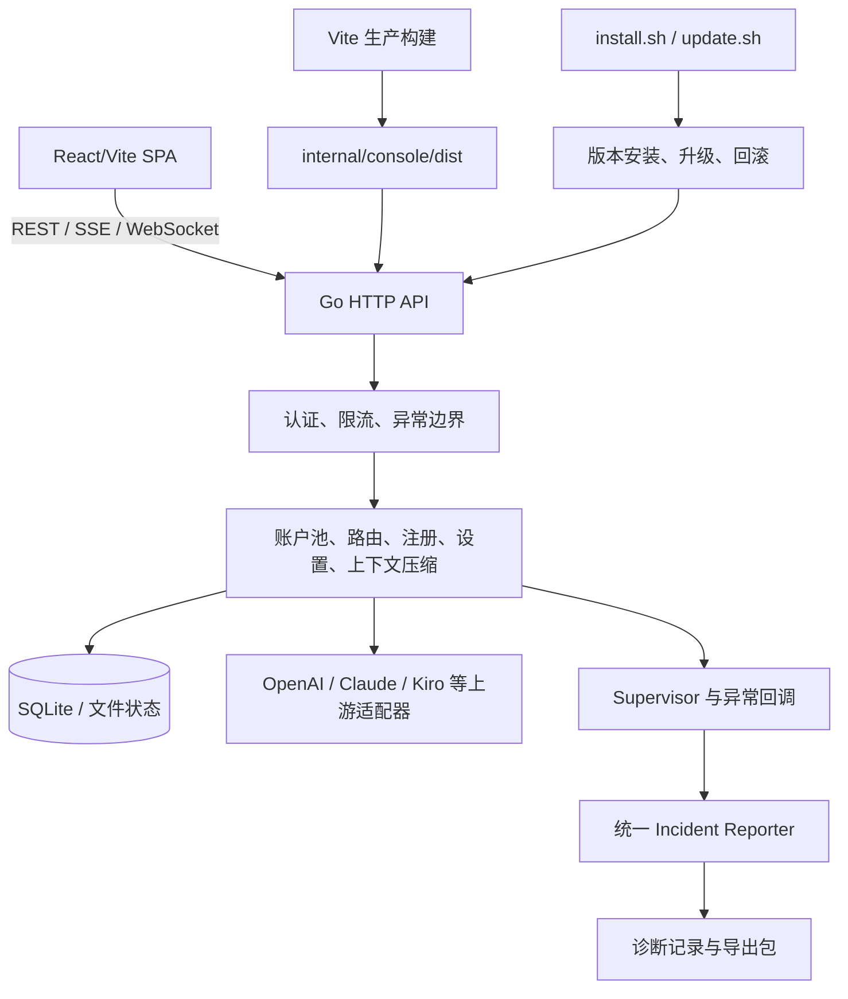
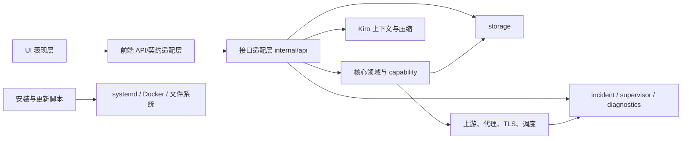
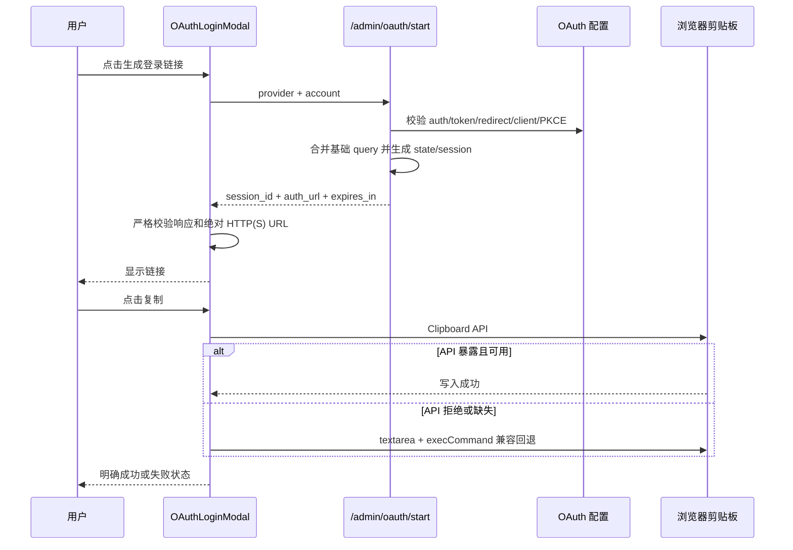
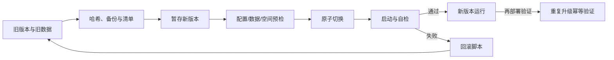

# 全栈功能逻辑逐项审计与修复报告（2026-08-02）

> 执行依据：[`docs/plan/1.txt`](../plan/1.txt)
>
> 延续基线：[`docs/项目全栈优化审计-2026-07-29.md`](../项目全栈优化审计-2026-07-29.md)
>
> 现场诊断包：[`2026-08-02-example-zip-diagnostic-analysis.md`](./2026-08-02-example-zip-diagnostic-analysis.md)
> 本报告只记录本轮逐页、逐模块的功能审计和已落地修复；此前的容量、路由、调度与竞品审计结论仍由上面的基线报告承载。

## 1. 结论

- 使用当前生产构建、真实嵌入式 Go 服务和无头 Chromium 逐一访问 **26 个管理端页面、14 个兼容路由、4 个用户门户页面**，结果 **44/44 通过**。
- 浏览器运行期间记录到 **0 个运行时异常、0 个 HTTP 5xx、0 个错误边界、0 个横向溢出**。
- 用户点名的“生成链接后复制失败”已修复，并完成从真实 `/admin/oauth/start` 到系统剪贴板读回的端到端验证：链接为绝对 HTTPS URL，包含 `state` 与 `client_id`，读回内容与生成内容完全一致。
- 审计过程中共定位并修复 10 类真实逻辑或稳定性问题：OAuth 响应误判、剪贴板能力误判、OAuth URL 拼接、默认配置缺失、空用户列表返回 `null`、Vitest 并发失控、E2E 控件迁移漂移、缺少可复用的在线逐页检查器、自检误扫历史归档，以及新增运行脚本未及时进入升级清单。
- 保留旧路由、旧字段和旧空响应的兼容层；未删除疑似冗余代码，也未改变现有 API 或数据格式的对外行为。

## 2. 当前架构与关键链路

### 2.1 系统架构

### 2.2 模块依赖

### 2.3 OAuth 生成与复制链路

### 2.4 请求、异常与诊断数据流

### 2.5 安装、更新与回滚流程

### 2.6 可选能力加载

项目当前不是动态二进制插件系统；可选能力主要通过 Provider、路由、配置和适配器注册加载。继续沿用此边界比引入进程内动态链接插件更符合当前单体服务规模。

## 3. 本轮发现与修复

| ID | 问题与复现 | 根因 | 已实施修复 | 兼容性/风险 | 验证 |
|---|---|---|---|---|---|
| F01 | OAuth 后端返回缺字段或畸形 URL 时，前端仍进入“已生成”状态 | 组件只做宽松真假判断 | 新增 `normalizeOAuthStartResult`，严格校验对象、会话 ID、绝对 HTTP(S) URL、主机和有效期；兼容 snake_case/camelCase | 仅拒绝此前本就不可用的响应；合法旧字段继续支持 | 组件红绿测试与 Chromium E2E 通过 |
| F02 | 部分嵌入式浏览器点击复制无结果 | 把 `isSecureContext` 当成 Clipboard API 的先决条件；回退输入框对 iOS 不稳 | 改为能力探测：API 暴露即尝试，拒绝后自动回退；空值直接失败；增强 textarea 定位、focus 与 selection | 保留旧浏览器 `execCommand` 回退 | 单测覆盖非安全上下文、API 拒绝、空值；真实剪贴板读回一致 |
| F03 | OAuth 基础地址带 query 时生成 `...?tenant=x?client_id=...` | 手工字符串拼接 URL | 使用 URL 解析与 query 合并；校验 auth/token/redirect、state、client ID、PKCE；持久化 session 前先完成校验 | 已有无 query 配置结果不变 | Go 单测覆盖 query、非法 scheme/host/redirect/PKCE |
| F04 | 直接调用 `config.Default()` 时 OAuth 配置为空 | 默认构造函数漏填各 Provider OAuth 默认值 | 补齐 Codex、Claude、Antigravity 的 auth/token/client/redirect/scope/secret 默认项 | 配置文件和环境变量仍可覆盖 | 默认值契约测试与 OAuth 集成测试通过 |
| F05 | 空数据库访问 `/users` 显示“接口返回了无法识别的数据” | Go 的 nil slice 编码成 JSON `null`，前端 schema 只接受数组 | 后端固定返回 `[]`；前端保留 `null -> []` 的旧服务兼容适配 | 新旧前后端交叉升级均可工作 | 真实服务先复现，修复后 `/users` 页面通过；前后端契约测试通过 |
| F06 | 1 核/1 GB 环境全量 Vitest 偶发 worker 启动超时 | jsdom 测试默认并发 fork 过多 | 默认 `maxWorkers=2`，保留 `VITEST_MAX_WORKERS` 显式覆盖 | 只影响测试调度，不影响产品运行 | 23 文件、122 测试稳定通过 |
| F07 | Playwright 视觉测试在分组页调用 `.selectOption()` 失败 | 原生 select 已迁移为无障碍自定义 combobox，测试未同步 | 改为按 combobox/option 角色操作 | 与真实用户交互一致 | 55/55 浏览器测试通过 |
| F08 | 缺少可重复的“真实后端 + 全路由 + OAuth 剪贴板”健康检查 | 原测试分别覆盖 API、组件或静态页面 | 新增 `scripts/check-live-fullstack.mjs` 和 `npm run check:live-fullstack`；路由直接读取权威定义 | 可通过环境变量配置地址、令牌、门户用户和输出 | 对当前嵌入式 Go 服务执行 44/44 通过 |
| F09 | `selftest.sh` 在当前源码已合规时仍可能于 gofmt 门禁静默退出 | `gofmt -l .` 扫入历史交付、旧版本和第三方快照，并把文件名藏在命令替换中 | 门禁只扫描当前 Go 源码根目录，失败时打印精确文件；同时格式化两处当前源码漂移 | 不改变编译和运行行为；历史证据保持只读 | 当前源码 gofmt 门禁和完整 `selftest.sh` 通过 |
| F10 | 新增在线全栈检查器可能在升级收敛时不受托管清单保护 | 新文件加入晚于上一次 manifest 生成 | 重新生成 `scripts/managed-source-manifest.txt`，明确包含 `web-spa/scripts/check-live-fullstack.mjs` | 文档仍按现有规则不进入运行源清单 | 清单精确匹配、第二次 prune 收敛和旧→新升级回归通过 |

## 4. 前端逐页功能检查

检查项统一包括：鉴权后可达、页面 readiness、数据请求、错误边界、浏览器运行时错误、HTTP 5xx、横向溢出；交互矩阵另覆盖增删改表单、筛选、分页、语言切换、失败态、注册、设置保存、OAuth 生成/复制。

### 4.1 当前管理端路由（26/26）

| # | 路由 | 核心功能 | 结果 | 实测耗时 |
|---:|---|---|---|---:|
| 1 | `/` | 总览、聚合状态 | PASS | 1026 ms |
| 2 | `/accounts` | 账户池、探测、导入与操作 | PASS | 582 ms |
| 3 | `/groups` | 分组与模型映射 | PASS | 583 ms |
| 4 | `/providers` | Provider 与路由配置 | PASS | 551 ms |
| 5 | `/models` | 模型目录 | PASS | 549 ms |
| 6 | `/egress` | 出口配置与排序 | PASS | 584 ms |
| 7 | `/upstream-error-rules` | 上游错误规则 | PASS | 567 ms |
| 8 | `/registration` | 自动注册与执行状态 | PASS | 600 ms |
| 9 | `/team-lifecycle` | 团队生命周期 | PASS | 599 ms |
| 10 | `/email-pool` | 邮箱池查询与配置 | PASS | 567 ms |
| 11 | `/email-pool/cloudflare` | Cloudflare 邮箱能力 | PASS | 583 ms |
| 12 | `/usage` | 用量统计 | PASS | 617 ms |
| 13 | `/quota` | 配额状态 | PASS | 566 ms |
| 14 | `/model-quality` | 模型质量 | PASS | 566 ms |
| 15 | `/system` | 系统状态与诊断 | PASS | 583 ms |
| 16 | `/cf-events` | Cloudflare 事件 | PASS | 568 ms |
| 17 | `/audit` | 审计日志 | PASS | 583 ms |
| 18 | `/keys` | 管理密钥 | PASS | 566 ms |
| 19 | `/users` | 用户管理与空列表 | PASS | 567 ms |
| 20 | `/settings-v2` | 通用设置、校验与保存 | PASS | 567 ms |
| 21 | `/settings/ai/chatgpt` | ChatGPT AI 设置 | PASS | 566 ms |
| 22 | `/settings/ai/claude` | Claude AI 设置 | PASS | 567 ms |
| 23 | `/settings/ai/kiro` | Kiro 设置与压缩策略 | PASS | 566 ms |
| 24 | `/settings/ai/antigravity` | Antigravity AI 设置 | PASS | 567 ms |
| 25 | `/settings/ai/codex` | Codex AI 设置 | PASS | 566 ms |
| 26 | `/settings/ai/claude-code` | Claude Code AI 设置 | PASS | 567 ms |

### 4.2 旧地址兼容路由（14/14）

| 旧路由 | 目标行为 | 结果 | 实测耗时 |
|---|---|---|---:|
| `/settings` | 跳转 `/settings-v2?tab=config` | PASS | 284 ms |
| `/automation` | 跳转 `/settings-v2?tab=automation` | PASS | 283 ms |
| `/thinking` | 跳转 `/settings-v2?tab=thinking` | PASS | 300 ms |
| `/moderation` | 跳转 `/settings-v2?tab=moderation` | PASS | 300 ms |
| `/settings/ai` | 跳转 ChatGPT AI 设置 | PASS | 283 ms |
| `/ai-settings` | 跳转 ChatGPT AI 设置 | PASS | 284 ms |
| `/model-settings` | 跳转 ChatGPT AI 设置 | PASS | 300 ms |
| `/settings/models` | 跳转 ChatGPT AI 设置 | PASS | 299 ms |
| `/settings/models/chatgpt` | 跳转对应新路由 | PASS | 301 ms |
| `/settings/models/claude` | 跳转对应新路由 | PASS | 283 ms |
| `/settings/models/kiro` | 跳转对应新路由 | PASS | 283 ms |
| `/settings/models/antigravity` | 跳转对应新路由 | PASS | 284 ms |
| `/settings/models/codex` | 跳转对应新路由 | PASS | 300 ms |
| `/settings/models/claude-code` | 跳转对应新路由 | PASS | 299 ms |

### 4.3 用户门户（4/4）

| 路由 | 核心功能 | 结果 | 实测耗时 |
|---|---|---|---:|
| `/portal` | 用户用量总览 | PASS | 864 ms |
| `/portal/keys` | 用户密钥 | PASS | 567 ms |
| `/portal/models` | 可用模型 | PASS | 566 ms |
| `/portal/profile` | 用户资料 | PASS | 566 ms |

页面导航耗时统计：最小 283 ms，中位数 566 ms，P95 600 ms，最大 1026 ms。该数据来自同机真实服务和无头浏览器，只用于本次回归对比，不外推为公网延迟指标。

## 5. 后端逐模块逻辑检查

| 模块 | 重点检查 | 本轮结果 |
|---|---|---|
| 启动与异常边界 | 配置初始化、panic/goroutine 捕获、退出顺序 | PASS；统一 supervisor callback 与 incident reporter 已覆盖 |
| API 认证与管理接口 | 管理令牌、用户令牌、资源 CRUD、空响应契约 | PASS；修复用户空列表 `null` |
| 设置中心 | 读取、校验、热更新、旧字段兼容 | PASS；前端设置保存与错误展示有专门回归 |
| 邮箱池 | 配置、兼容接口、Cloudflare 页面与存储 | PASS；契约与响应式页面回归通过 |
| OAuth 与重认证 | URL 构造、PKCE、session、轮询、复制 | PASS；修复 F01-F04，并完成真实链路验证 |
| 诊断系统 | 错误、panic、超时、回调、导出与回放 | PASS；稳定写入与诊断包测试通过 |
| Kiro 上下文 | 摘要压缩、Codex/Claude 接力、midstream、keepalive | PASS；目标测试、流式边界和上下文日志通过 |
| 调度、路由与 admission | 等待、回放、失败切换、配额/能力选择 | PASS；目标回归与 race 检查通过 |
| Storage | SQLite 读写、目标连续性、邮箱池、空集合 | PASS；单元与并发测试通过 |
| 上游、代理与 TLS | Provider 适配、出口、错误分类、协议转发 | PASS；未观察到 5xx 或协议回归 |
| 注册与团队生命周期 | 参数兼容、Provider 流程、任务状态 | PASS；浏览器与后端测试均覆盖 |
| Console 嵌入 | Vite 产物、Go embed、SPA fallback、旧路由 | PASS；当前生产产物被真实服务加载 |
| 安装、更新与回滚 | 旧数据保留、清单、切换、回滚、重复部署 | PASS（本地隔离根目录）；最终交付再次执行并记录 |

## 6. 冗余与耦合审计

### 6.1 功能冗余

| 项目 | 位置 | 当前用途 | 重复对象 | 可合并性 | 风险 | 处理决定 |
|---|---|---|---|---|---|---|
| 异步资源状态 | 多个旧 JSX 页面 | loading/error/retry | `useAsyncResource` 与页面内状态 | 中 | 动态页面行为差异 | 保留，新增页面优先复用 hook，分批迁移并逐页回归 |
| API 字段转换 | 前端 feature API 与 Go 兼容 handler | 新旧 snake/camel/空值兼容 | 两端适配 | 低 | 删除任一端会破坏交叉升级 | 明确保留为版本防腐层 |
| AI 设置路由 | 多个旧地址 | 历史书签与入口 | 新 `/settings/ai/*` | 不直接合并 | 外部链接依赖 | 保留显式 redirect，并纳入每次 E2E |
| 诊断脚本入口 | `diagnose-*`、collect/fetch 脚本 | 不同现场采集方式 | 部分公共步骤重复 | 中 | 运维自动化依赖脚本名 | 底层复用通用 reporter/导出，保留入口兼容 |
| 表单控件 | 新 pool 组件与遗留页面控件 | 业务表单 | 样式和校验有重叠 | 中 | 一次性替换会改变交互 | 新代码使用公共组件，旧页按回归批次迁移 |

未删除上述代码：静态引用、旧路由、脚本入口、跨版本接口和运行时配置均可能构成外部依赖。

### 6.2 耦合矩阵

| 发起模块 → 被依赖模块 | API | Storage | 调度/上游 | Diagnostics | UI 契约 | 等级与拆分方向 |
|---|---:|---:|---:|---:|---:|---|
| `internal/api` | — | 高 | 高 | 中 | 中 | **高**：handler 仍承担部分编排；继续抽取应用服务，但保留 HTTP 兼容层 |
| 账户/注册领域 | 中 | 高 | 中 | 低 | 低 | **中**：用 storage 接口和任务服务隔离事务细节 |
| Kiro/流式上下文 | 中 | 中 | 高 | 中 | 低 | **高**：协议状态复杂；保持 converter/compaction/journal 独立测试边界 |
| Supervisor/Incident | 低 | 低 | 低 | — | 低 | **低**：通用回调接口已形成，可供新增代码复用 |
| React 页面 | 中 | 低 | 低 | 低 | — | **中**：`Accounts`、`Groups`、`SettingsV2` 体积较大；按 feature hook/section 渐进拆分 |
| 安装与更新脚本 | 中 | 中 | 低 | 中 | 低 | **中**：依赖文件清单和平台命令；以 manifest、preflight 和 rollback 边界收敛 |

未发现新增循环依赖。当前最高耦合集中在 API 编排、流式协议状态和三个大页面；本轮只做低风险缺陷修复，没有为了降指标而重写成熟链路。

## 7. 稳定性、性能与资源结论

### 7.1 已确认并处理

- **测试进程资源峰值**：jsdom 默认并发可在 1 核/1 GB 环境触发 worker 启动超时；默认限制为 2 个 worker，同时保留显式扩容开关。
- **前端包体**：主入口 425.52 kB（gzip 126.07 kB），图表 vendor 418.50 kB（gzip 119.05 kB）；路由页面已异步拆包。图表包是当前最大独立块，属于可继续观测项，而非功能阻断。
- **浏览器页面耗时**：44 页中位数 566 ms、P95 600 ms，无 5xx、运行时错误或溢出。
- **异常容灾**：请求错误、panic、goroutine、timeout 均可进入统一 reporter；导出诊断包可用于回放。
- **升级容灾**：以原始哈希、源归档、binary patch、验证记录和可执行 rollback 形成闭环。

### 7.2 继续观测

- `Accounts`（69.71 kB）、`SettingsV2`（43.75 kB）、`Groups`（36.20 kB）仍是最大的业务页面块，后续新增功能应优先下沉至 feature hooks 与独立 section。
- 公网 OAuth 端点耗时、真实第三方限流、远端数据库 I/O 不由本地逐页耗时代表，应继续由生产指标和诊断包观测。
- 浏览器 `execCommand` 是旧环境兼容回退；主路径已优先使用 Clipboard API。

## 8. 验证矩阵与证据

| 层次 | 命令/场景 | 结果 |
|---|---|---|
| Go 静态检查 | `go vet ./...` | PASS |
| Go 全量 | `go test ./... -count=1` | 71 packages；最终交付记录保存完整输出与状态 |
| 关键并发 | `go test -race ./internal/api ./internal/config -run "OAuth|AdminUsers|AdminUser" -count=1` | PASS |
| 前端静态/单元/构建 | `npm run verify` | 23 files / 122 tests；生产构建 PASS |
| 浏览器 E2E | `npm run test:e2e` | 55/55 PASS，包含 11 个 WCAG 场景 |
| 真实全栈逐页 | `npm run check:live-fullstack` | 44/44 PASS；OAuth 链接和实际剪贴板 PASS |
| 全栈证据 | `web-spa/.run/live-fullstack-audit-admin-portal.json` | SHA-256 `fd1965ad8bd5b4ac15099df0ed839c43837c709d36c78ee140e0ab80d9fb8fc6` |

`check-live-fullstack.mjs` 的 OAuth 证据只保留协议、主机、字段存在性和剪贴板匹配布尔值，不保存 state、session 或凭据。

## 9. 发布判定

功能逻辑审计、前后端契约、逐页浏览器验证和用户点名的链接复制问题均已闭环。发布前的最终门禁为：对当前暂存树再执行全量 Go 回归、静态检查、构建/自检、旧版升级/回滚/再部署、四角色交付物重开验证，并重试指定云环境；每项的字面输出、退出码和哈希写入最终 verification record。
